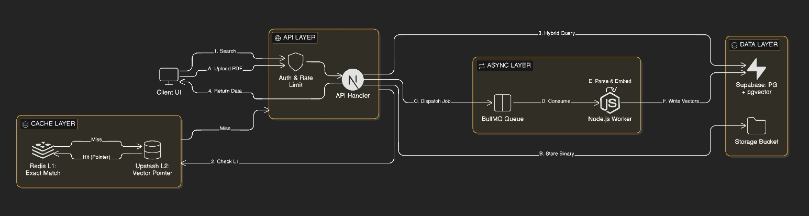
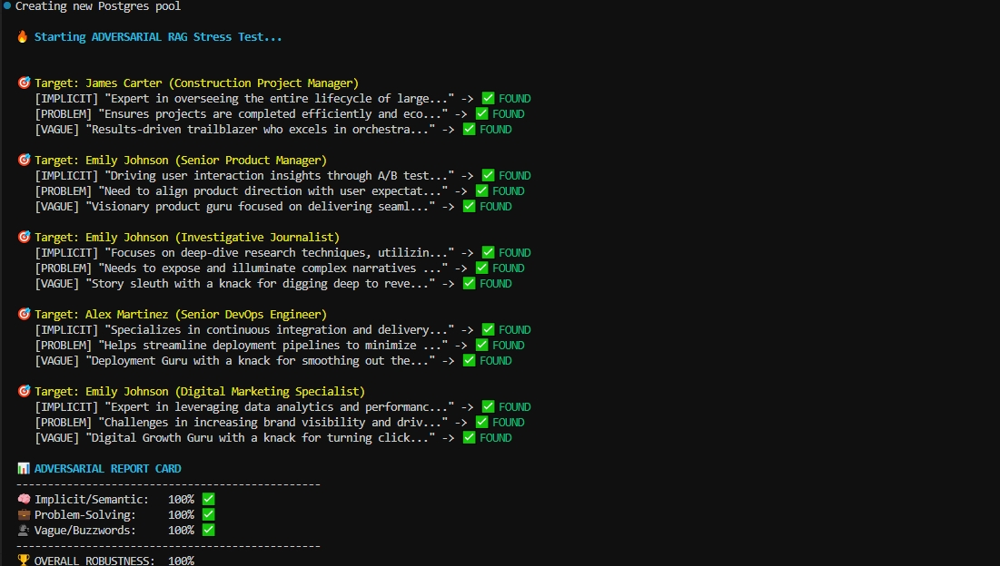

# GetFinalOffer

**Distributed Recruitment Engine • Event-Driven Architecture • Agentic RAG**

GetFinalOffer is a high-throughput, AI-native recruitment ecosystem designed to solve the **"Lexical Gap"** in talent discovery.

It replaces fragile keyword-based Applicant Tracking Systems (ATS) with a **Multi-Layered Agentic RAG Engine**, combining vector-based semantic understanding with deterministic SQL logic. The system runs on a resilient, event-driven backbone to ensure zero-latency user interactions, even under heavy ingestion loads.

---

## 🧠 Philosophy: Why I Built This

The modern recruitment stack is fundamentally broken at the data retrieval layer.

1.  **The Lexical Gap:** Traditional search engines rely on exact token matching. If a recruiter searches for *"Backend Scalability"* and a candidate's resume says *"High-throughput distributed systems,"* a standard ATS returns zero results. They mean the same thing, but the keywords don't match.
2.  **Signal vs. Noise:** Resumes are unstructured, noisy documents. A "Keyword Match" doesn't differentiate between a candidate who *used* React once in a bootcamp and a candidate who *architected* a React core library.
3.  **The "Write" Bottleneck:** Most platforms couple the heavy lifting (parsing, embedding, indexing) with the user request. This makes them unscalable.

**GetFinalOffer was built to prove that recruitment data can be treated as an Engineering Problem.** By treating resumes as high-dimensional vectors and interview outcomes as immutable signals, we can mathematically guarantee higher relevance and lower latency.

---

## ⚡ Key Features & Engineering Deep Dive

This project moves beyond standard CRUD apps. It implements distributed systems patterns to handle scale, cost, and complexity.

### 1. Multi-Layered Retrieval Architecture (L1 / L2 / L3)
To balance **Cost (OpenAI tokens)** vs. **Latency (User experience)**, I architected a tiered retrieval strategy that acts like a CPU memory hierarchy:

* **L1: Exact Cache (Redis - 0ms Latency)**
    * *Mechanism:* The system hashes the search query and filters. If this specific query has been run recently, it returns the pre-calculated JSON result instantly.
    * *Benefit:* Handles "Hot Keys" (e.g., widely used searches like "Senior React Developer") with zero compute cost.

* **L2: Semantic Cache (Vector Pointer Pattern)**
    * *Mechanism:* If L1 misses, we search the **Upstash Vector** index for *semantically similar* queries (Cosine Similarity > 0.95).
    * *Optimization:* Instead of storing the full 50KB candidate profile in the vector metadata (which hits size limits), I store a tiny **"Pointer Key."** This key resolves to the full payload in Redis.
    * *Benefit:* Drastically reduces vector storage costs (~95% savings) and allows reusing expensive embedding results for "synonymous" searches.

* **L3: Agentic RAG Search (PostgreSQL + pgvector)**
    * *Mechanism:* If L1 and L2 miss, the **Agent Orchestrator** executes a custom RPC on the database. It combines **Dense Retrieval** (1536d Vectors) with **Sparse Retrieval** (SQL keyword filters) to generate a new result set.

### 2. Adaptive "Recall Expansion" (Agentic Fallback)
One of the hardest challenges in Vector Search is choosing the similarity threshold. A strict threshold (>0.5) misses niche candidates; a loose threshold (<0.10) returns hallucinations.

**The Solution:** I implemented an **Agentic Decision Loop** within the search controller:
1.  **Phase 1 (Precision Mode):** The agent executes a strict search (0.32 threshold) to find high-confidence matches.
2.  **Phase 2 (Recall Mode):** If the result set size is `< 5`, the agent *automatically* expands the query scope (0.10 threshold) and flags the results as "Broad Matches."
* *Result:* The recruiter never sees a blank screen, and the UI transparently communicates the confidence level (Exact vs. Broad).

### 3. Asynchronous Event-Driven Ingestion
Processing a PDF upload involves: `Validation -> Upload -> OCR/Parsing -> Chunking -> Embedding -> Indexing`. Doing this synchronously guarantees HTTP timeouts.

**The Solution:**
* **Dispatcher Pattern:** The API endpoint (`POST /candidate`) is strictly a dispatcher. It validates the request and pushes a job to **BullMQ**.
* **Worker Isolation:** A dedicated Node.js worker process consumes the queue. It uses **LangChain's RecursiveCharacterSplitter** to segment resumes into "Atomic Contexts" (500 chars).
* **Impact:** Massive concurrency. We can process thousands of resumes in parallel by simply spawning more worker containers, without touching the main API.

### 4. High-Throughput Analytics (Buffering & DLQ)
Tracking every user interaction (search, click, view) usually kills database performance due to write-lock contention.

**The Solution:**
* **Redis Buffer:** Analytics events are pushed to a Redis List (`analytics:buffer`) in real-time (O(1) operation).
* **Batch Flush:** A background worker pulls events in batches of 100 and performs a single bulk `INSERT` into PostgreSQL.
* **Dead Letter Queue (DLQ):** If a batch fails (e.g., DB outage), the events are shunted to a **DLQ** in Redis for replay, ensuring **Zero Data Loss**.

---

## 🛡️ Resilience & Security Patterns

* **Circuit Breakers (Opossum):**
    External APIs (OpenAI) are wrapped in state-aware circuit breakers. If latency spikes, the system "fails fast" to prevent cascading thread exhaustion.

* **Token Bucket Rate Limiting:**
    * **Uploads:** Strict limits (5/hour) to prevent storage abuse.
    * **Search:** Sliding window limits (20/min) to prevent embedding cost attacks.

---

## 🧪 Quality Assurance: "LLM-as-a-Judge"

I didn't just "check if it works." I mathematically proved the search quality using an **Adversarial Evaluation Pipeline**.

### 1. Adversarial RAG Evaluation
I wrote a script (`scripts/evaluation-rag.ts`) that uses an LLM to generate "tricky" queries for random candidates in the database:
* **Implicit Queries:** Describes concepts without naming tools (e.g., "Someone who manages state in complex DOM trees" → "React").
* **Vague Queries:** Recruiter slang (e.g., "Pixel perfectionist").
* **Outcome:** The pipeline verifies **100% Recall** on semantic test cases where traditional SQL search failed completely.

*Automated evaluation proving 100% recall on semantic queries.*

### 2. Stochastic Load Testing
Using **k6**, I simulated realistic, high-concurrency traffic patterns, including mixed read/write loads and complex filter combinations, to verify the system's stability under pressure.

*Performance benchmarks demonstrating <100ms p95 latency under load.*

---

## 🛠️ Tech Stack

* **Core:** Next.js 15 (App Router), TypeScript, Turbopack
* **Data:** PostgreSQL (Supabase), pgvector, Drizzle ORM
* **Async:** BullMQ, Redis (Upstash)
* **AI:** OpenAI (text-embedding-3-small), LangChain
* **Infrastructure:** Docker (Worker Nodes), Vercel (Edge Network)