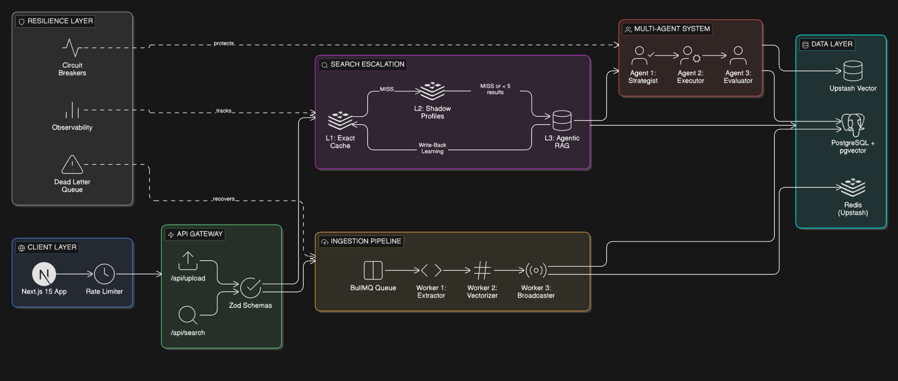
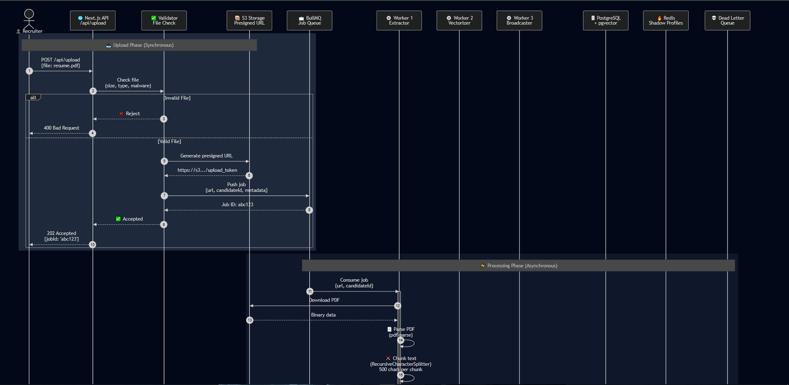
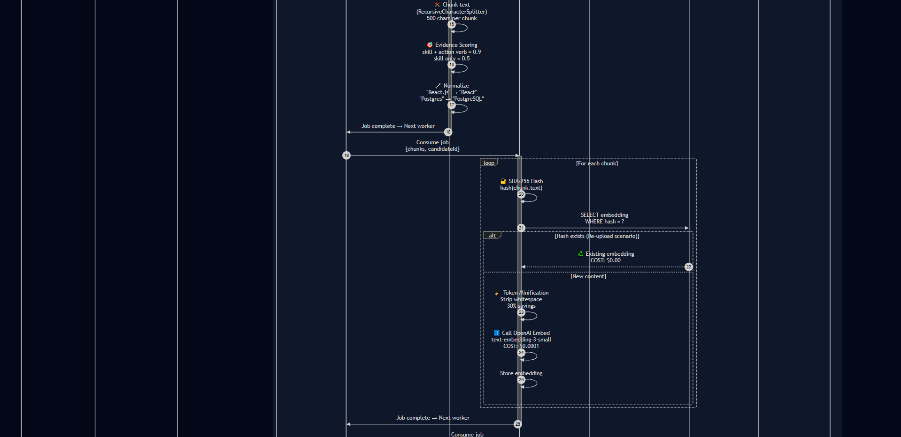
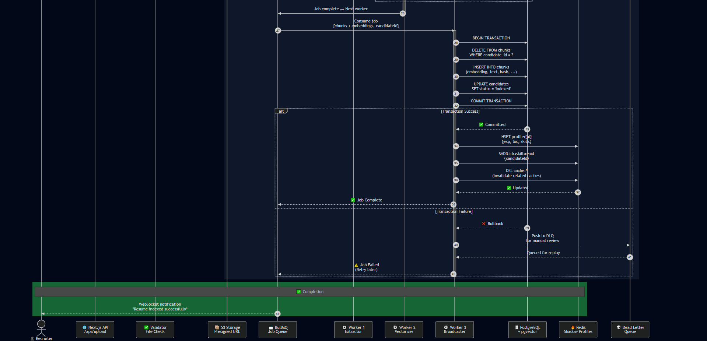
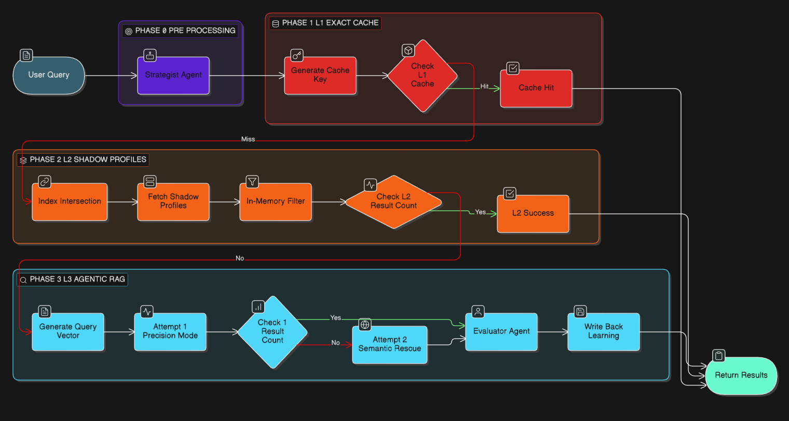
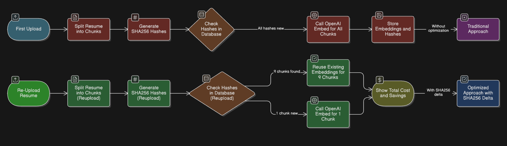
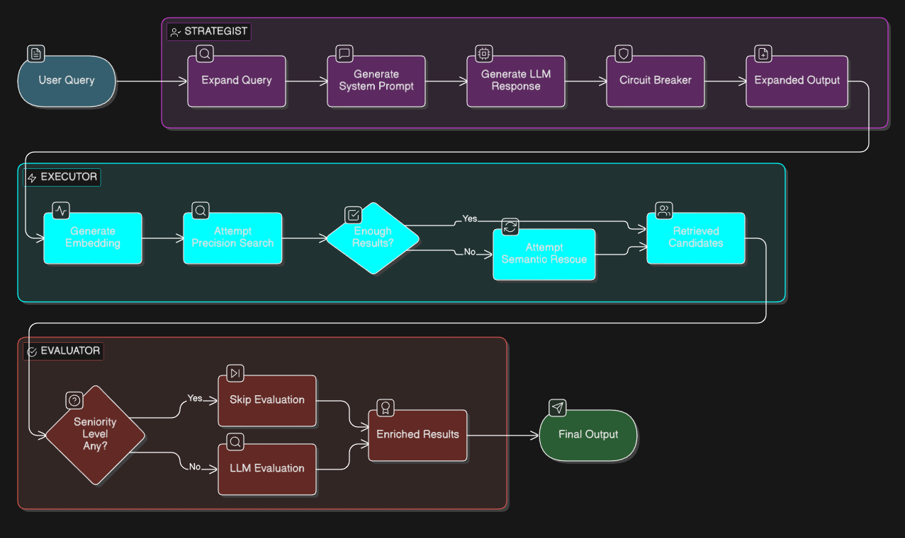
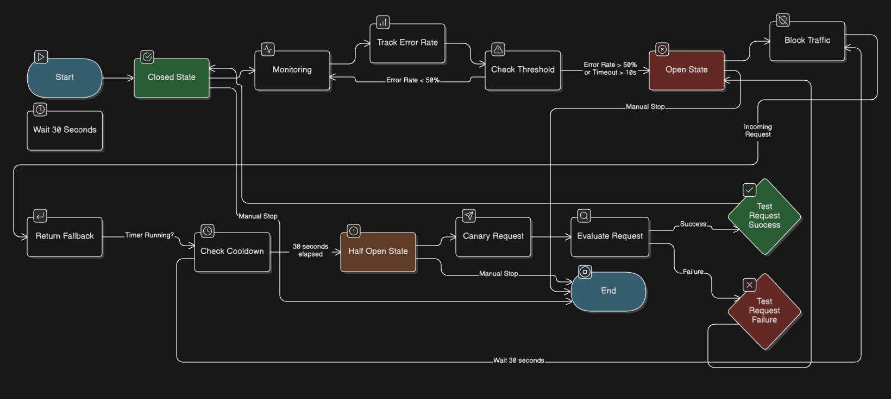

# GetFinalOffer

Recruiting intelligence platform with hybrid search, asynchronous resume ingestion, and graph-based skill expansion.

## What this is

GetFinalOffer connects two sides of hiring:

- **Candidates** create a profile, upload a resume, and record verified interview progress at partner companies. A verification pipeline backs profile claims with documents.
- **Recruiters** at partner organisations search for candidates with a hybrid pipeline: LLM query expansion, a skill taxonomy graph on Neo4j, Redis live indexes, and vector semantic search, with reranking and AI-generated relevance notes on the results.

The core problem it attacks: recruiters and candidates describe the same skills with different language.

- Recruiter query: `Machine Learning Engineer`
- Candidate profile: `Python`, `PyTorch`, `MLOps`, `Docker`, `Statistics`

Keyword-only search misses that profile. The skill graph expands from role and skill seeds into related skills, and the graph score blends into the baseline ranking. Every graph step is feature-flagged and circuit-broken, so search still works when the graph is down.

## Features

**Search (recruiter side)**
- Hybrid retrieval with tiered fallback: exact cache → semantic cache → Redis live index → vector search
- Conversational queries ("backend wizard") are expanded into concrete technical terms before retrieval
- Neo4j graph expansion with IDF-weighted scoring, depth penalties, and per-seniority top-k
- Cross-encoder reranking of query/passage pairs with a timeout-guarded fallback to the baseline order
- AI evaluation produces a one-line relevance rationale for the strongest matches
- Candidates who blocked a recruiter's organisation are invisible in every retrieval path

**Ingestion (candidate side)**
- Resume upload flows through an asynchronous queue: LLM skill extraction with confidence scoring, chunking, batched embeddings, and index publication
- Interview-progress tracking with per-entry verification states
- Content-hash dedupe keeps re-uploads from re-embedding unchanged resume text

**Platform**
- Email/password accounts with candidate and recruiter roles; recruiter signup requires an email domain matching a partner organisation (verified server-side)
- Document verification pipeline with private storage, rate-limited uploads, and a review queue that approves or rejects claims
- Batched client analytics → Redis buffer → worker → Postgres, with a dead-letter queue
- Graph rollout telemetry: per-minute metrics, alert evaluation, and rollout snapshots
- Error tracking and distributed tracing hooks

## Architecture

### High-Level Architecture

### Ingestion Pipeline

### Search Flow

### Additional System Visuals

## Search pipeline

### Baseline search
1. The recruiter search API validates the caller is a recruiter and rate-limits the request.
2. Page-1 queries hit the exact cache, then the semantic cache.
3. The live Redis index and the vector path retrieve the baseline pool.
4. If both come up empty, the browse path returns recently indexed candidates.

### Graph expansion path
1. Graph execution is controlled by feature flags (`off|shadow|on` plus a traffic-percentage hash).
2. The query and the strategist's expanded keywords become deterministic graph seeds (exact match, then contains fallback).
3. Neo4j returns related skills via role/skill/alias traversal, cached with a configurable TTL.
4. Graph scores blend into the baseline ranking when the mode is `on`; in `shadow` mode the scores are recorded but not applied.
5. A circuit breaker and per-stage fallbacks keep the baseline path available when Neo4j is slow or unreachable.

### Measured snapshot (local, shadow tuning)
- Cached graph expansion: `p50 ~40ms`, `p95 ~50ms`
- Uncached graph expansion: `p50 ~430ms`, `p95 ~855ms`
- Fallback rate in the uncached benchmark: `0%` on the tested set

These numbers are environment-specific. Re-measure in your own environment before ramping traffic.

## Skill graph module

- `lib/graph/driver.ts`: Neo4j driver lifecycle
- `lib/graph/circuit-breaker.ts`: opossum-wrapped graph query protection
- `lib/graph/expansion-service.ts`: seed lookup + traversal + cache
- `lib/graph/scoring.ts`: depth/weight/idf/top-k scoring
- `scripts/graph/*.ts`: taxonomy import/build/validate/sync/benchmark tooling
- `workers/graph-*.ts`: sync, metrics flush, alert evaluation, proposal ranking

The taxonomy is built from a curated base of skills, synonyms, and role relationships, with imports from public skill frameworks and a generator that composes domain modules into a unified graph.

## Roadmap

### Near-term
- Graph quality dashboarding: fallback and zero-expansion trends over time.
- Alias coverage improvements and taxonomy QA automation.

### Mid-term
- Reduce uncached graph latency through regional infrastructure alignment.
- Multilingual skill normalization and broader role coverage.
- Recruiter-facing explainability for individual graph matches.

## License

MIT License. See [LICENSE](LICENSE).

## Author

**Sandeep Bist**
- Portfolio: [sandeepbist.vercel.app](https://sandeepbist.vercel.app)
- LinkedIn: [linkedin.com/in/sandeepbist22](https://www.linkedin.com/in/sandeepbist22)
- GitHub: [@sandeepbist](https://github.com/sandeepbist)
- Email: sbist738@gmail.com
